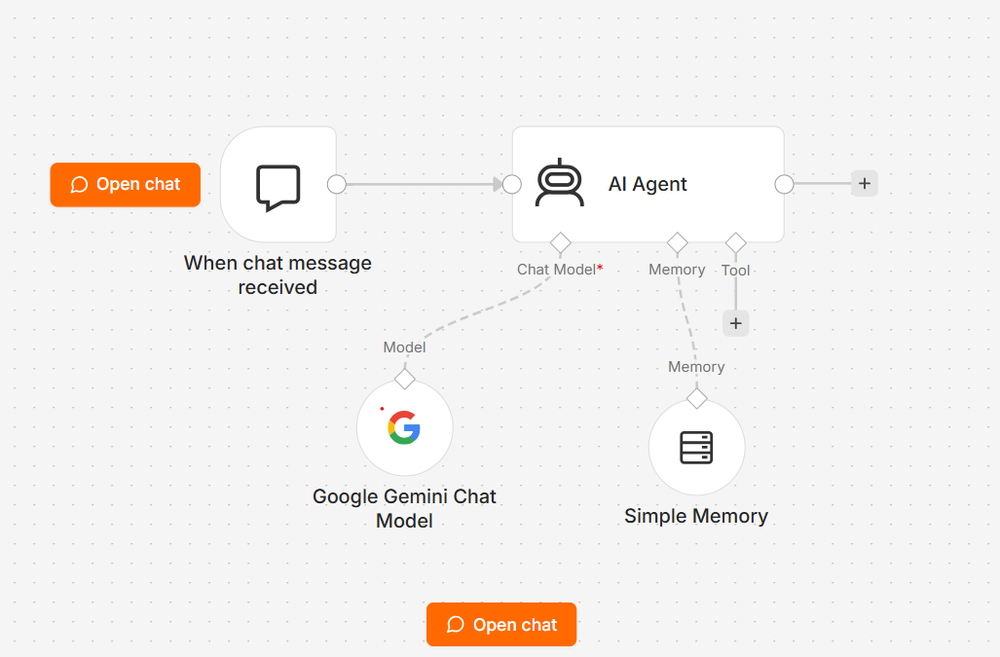

# 🤖 n8n Gemini AI Chatbot

An AI-powered chatbot workflow built using **n8n** and **Google Gemini**, featuring conversational memory for context-aware interactions.

---

## ✨ Features

- 🤖 AI-powered chatbot using Google Gemini
- 💬 Conversational memory support
- ⚡ Easy-to-import n8n workflow
- 🔒 Sanitized workflow (no sensitive credentials)
- 🚀 Beginner-friendly and customizable

---

## 🛠️ Tech Stack

- n8n
- Google Gemini API
- AI Agent
- Memory Buffer Window

---

## 📂 Project Structure

```
.
├── n8n-gemini-ai-chatbot.json
├── README.md
├── LICENSE
└── screenshots/
    └── n8n-gemini-ai-chatbot.png
```

---

## 📸 Workflow Preview



---

## 🚀 Getting Started

### 1. Clone the Repository

```bash
git clone https://github.com/your-github-username/n8n-gemini-ai-chatbot.git
```

### 2. Import the Workflow

1. Open **n8n**.
2. Click **Import from File**.
3. Select **n8n-gemini-ai-chatbot.json**.

### 3. Configure Google Gemini Credentials

Create your own **Google Gemini API** credentials in n8n and assign them to the **Google Gemini Chat Model** node.

### 4. Activate the Workflow

Save and activate the workflow. Your AI chatbot is now ready to use.

---

## 🔒 Security

This workflow has been sanitized before publishing.

The following sensitive information has been removed:

- API Keys
- Credential References
- Webhook IDs
- Instance IDs
- Workflow IDs
- Version IDs

You'll need to configure your own credentials after importing the workflow.

---

## 🎯 Use Cases

- AI Chat Assistant
- Customer Support Bot
- FAQ Bot
- Personal Productivity Assistant
- Learning n8n AI Automation

---

## 🤝 Contributing

Contributions are welcome!

Feel free to fork the repository, open issues, or submit pull requests to improve the project.

---

## 📜 License

This project is licensed under the MIT License.
